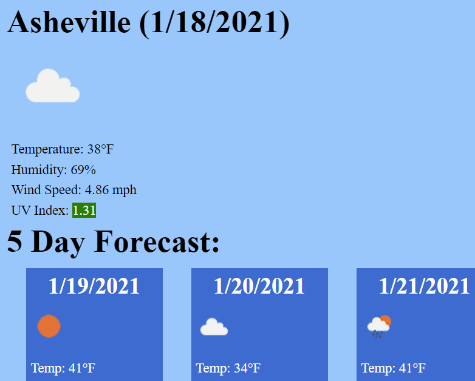

# Weather Dashboard
TABLE OF CONTENTS
1. Purpose
2. Preview
3. License 

## PURPOSE

The goal of this project is the build a weather dashboard that utilizes the OpenWeather API. Users can search for a city name, and will be given the current weather conditions, as well as a 5 day forecast. Their searches will also be saved and can easily be used again. If the user closes or refreshes the page, their most recent search will be saved.

## PREVIEW

https://jrdavis4.github.io/weather/

## License

All content is public domain, help yourself!
